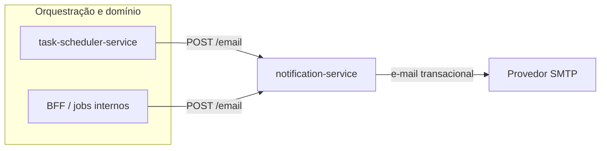

# notification-service

Microserviço de envio de notificações por e-mail, construído com **Spring Boot**. Exposto como API REST: recebe dados da tarefa, monta o corpo com **Thymeleaf** e dispara o e-mail via **Java Mail**.

<div align="center">

[](https://openjdk.org/)
[](https://spring.io/projects/spring-boot)
[](https://gradle.org/)
[](https://github.com/Javanauta/notification-service/actions/workflows/gradle.yml)
[]()

</div>

> Se o repositório no GitHub tiver outro `owner` ou nome, atualize a URL do badge de **CI** (ou remova o badge até o remote estar definido).

## Papel no Ecossistema

O `notification-service` é responsável pelo **envio de notificações** a partir de eventos e decisões feitas em outros serviços: ele concentra a lógica de formatação (template) e o disparo do e-mail, sem orquestrar tarefas nem regras de negócio de agendamento.

**Integrações:**

- Consumido pelo `task-scheduler-service` para envio de notificações
- Pode ser acionado por BFF ou jobs internos
- Atua como etapa final do fluxo de notificação do sistema

## Arquitetura (Visão de Sistema)

1. O `task-scheduler-service` identifica tarefas pendentes (ou o equivalente no seu domínio)
2. Envia requisição HTTP para o `notification-service` (ex.: `POST /email` com o payload da tarefa)
3. Este serviço processa o template Thymeleaf e envia o e-mail via SMTP
4. O **status** da tarefa pode ser atualizado em outro serviço ou em um passo posterior (fora do escopo desta API, que hoje responde `200` ao concluir o envio)



Essa visão conecta o `notification-service` ao restante do ecossistema: ele é o **ponto de entrega** da notificação, não a fonte de verdade do estado da tarefa.

## Visão geral

- **Entrada:** `POST /email` com JSON (`TarefasDTO`).
- **Processo:** template HTML `notificacao` + envio SMTP (configurável por variáveis de ambiente).
- **Porta padrão:** `8082` (veja `application.yaml`).

## Tecnologias

| Categoria   | Tecnologia |
|------------|------------|
| Runtime    | Java 17   |
| Framework  | Spring Boot 3.5.x |
| Web        | Spring Web |
| E-mail     | Spring Mail (SMTP) |
| Templates  | Thymeleaf |
| Build      | Gradle 8.14.x |

## Pré-requisitos

- **JDK 17** (o projeto usa [Java toolchain](notification-service/build.gradle) no Gradle)
- **Credenciais SMTP** (ex.: Gmail com senha de app, se for o caso)
- Acesso de rede à porta do servidor de e-mail

## Configuração

Crie as variáveis de ambiente usadas no `application.yaml`:

| Variável | Descrição |
|----------|------------|
| `EMAIL_USERNAME` | Usuário/conta de envio (também usada como `From` / remetente) |
| `EMAIL_PASSWORD` | Senha ou token do provedor SMTP |

O nome de exibição do remetente é configurado em `envio.email.nomeRemetente` (padrão no YAML: `Javanauta`).

## Executando

Na raiz **do módulo Gradle** (`notification-service/`):

**Linux / macOS**

```bash
cd notification-service
./gradlew bootRun
```

**Windows (PowerShell)**

```powershell
cd notification-service
.\gradlew.bat bootRun
```

A API sobe, por padrão, em `http://localhost:8082`.

## API

### `POST /email`

Envia um e-mail de notificação com base no corpo recebido.

- **Resposta de sucesso:** `200 OK` (corpo vazio).
- **Content-Type sugerido:** `application/json`

**Exemplo de corpo (campos alinhados ao DTO; apenas parte deles é usada no template atual):**

```json
{
  "id": "550e8400-e29b-41d4-a716-446655440000",
  "nomeTarefa": "Revisar documentação",
  "descricao": "Conferir links e formatação.",
  "dataCriacao": "2026-04-26T10:00:00Z",
  "dataEvento": "2026-04-28T15:00:00Z",
  "emailUsuario": "usuario@exemplo.com",
  "dataAlteracao": null,
  "status": "PENDENTE"
}
```

Valores de `status`: `PENDENTE`, `NOTIFICADO`, `CANCELADO`.

> O fluxo de envio utiliza hoje, no template, principalmente: `nomeTarefa`, `dataEvento`, `descricao` e o endereço em `emailUsuario`.

## Testes e build

```bash
cd notification-service
./gradlew test
./gradlew build
```

## CI

Pull requests para a branch `master` disparam o workflow [`.github/workflows/gradle.yml`](.github/workflows/gradle.yml) (build e testes com JDK 17 no Ubuntu).

## Estrutura (resumo)

```text
notification-service/          ← módulo Gradle (código e recursos)
  src/main/java/.../controller/   # REST (`/email`)
  src/main/java/.../business/     # Serviço de e-mail e DTOs
  src/main/resources/
    application.yaml
    application.properties
    templates/notificacao.html
.github/workflows/             # na raiz do repositório
```

## Licença

Definir no repositório (ex.: arquivo `LICENSE`) quando fizer sentido para o projeto.
